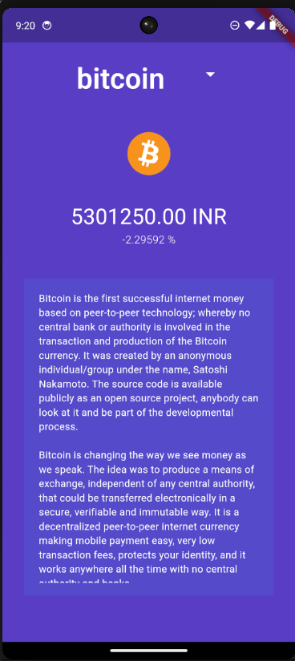
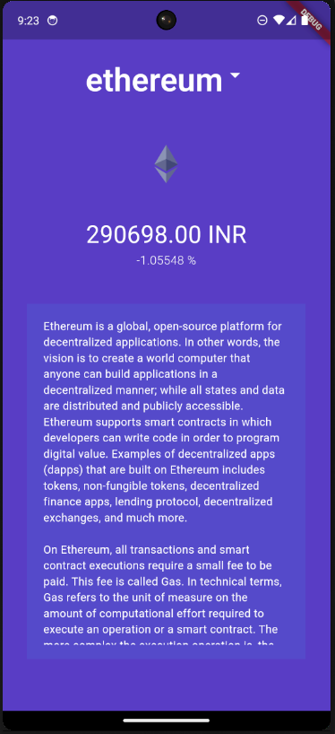
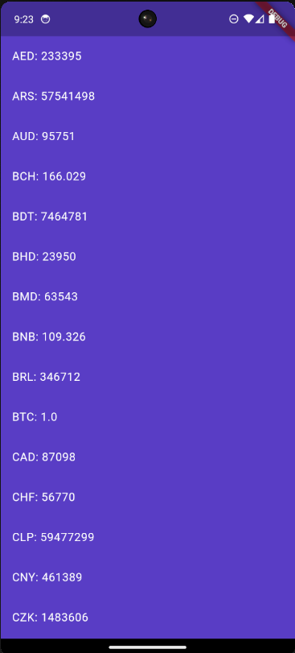

# CoinCap

- CoinCap is a Flutter application that allows users to view information about different cryptocurrencies.
- The app fetches data from the CoinGecko API and displays the current rate, percentage change in 24 hours, and a description of selected cryptocurrencies.
- Additionally, users can double-tap on the crypto coin icon to view its exchange rates in different currencies.
- All the information is dynamically rendered by fetching data from REST API.

## Product Image
,
,
,

